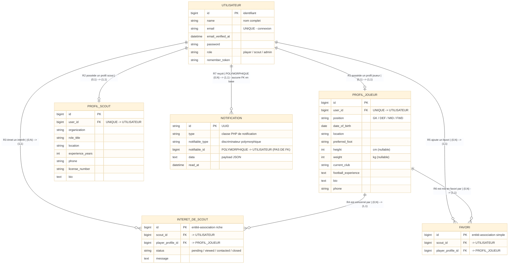

# TalentX11 — MCD (Modèle Conceptuel de Données)

> Plateforme de détection de talents footballistique — TalentX11
> Ce document présente le **MCD** restreint aux entités métier. Les tables techniques (framework Laravel) et le paquet Spatie (inutilisé) sont exclus du périmètre de présentation.

---

## 1. Diagramme MCD (notation Merise)

**Rendu :**

**Source (Mermaid) :**

> **Lecture des cardinalités** : la cardinalité écrite à côté d'une entité indique combien d'occurrences de l'**autre** entité sont reliées à une occurrence de cette entité.
> Le lien R7 (NOTIFICATION) est une référence **polymorphique**: il n'existe **aucune contrainte de clé étrangère** en base MySQL ; le rattachement est réalisé par la paire `notifiable_type` + `notifiable_id`.

---

## 2. Entités et attributs

### 2.1 UTILISATEUR — `users`

| Attribut | Type | Contraintes / notes |
|---|---|---|
| **id** (identifiant) | BIGINT | Clé primaire auto-incrémentée |
| name | VARCHAR | Nom complet |
| email | VARCHAR | **UNIQUE** — identifiant de connexion |
| email_verified_at | TIMESTAMP | Nullable |
| password | VARCHAR | Hash du mot de passe |
| role | VARCHAR | Discriminant : `player`, `scout`, `admin` (déf. `player`) |
| remember_token | VARCHAR | Nullable |

### 2.2 PROFIL_JOUEUR — `player_profiles`

| Attribut | Type | Contraintes / notes |
|---|---|---|
| **id** (identifiant) | BIGINT | Clé primaire auto-incrémentée |
| user_id | BIGINT | **FK vers UTILISATEUR**, **UNIQUE** (1:1), ON DELETE CASCADE |
| position | VARCHAR | Goalkeeper / Defender / Midfielder / Forward |
| date_of_birth | DATE | |
| location | VARCHAR | Ville / pays |
| preferred_foot | VARCHAR | Nullable — Right / Left / Both |
| height | SMALLINT UNSIGNED | Nullable (cm) |
| weight | SMALLINT UNSIGNED | Nullable (kg) |
| current_club | VARCHAR | Nullable |
| football_experience | TEXT | Nullable |
| bio | TEXT | Nullable |
| phone | VARCHAR | Nullable |

### 2.3 PROFIL_SCOUT — `scout_profiles`

| Attribut | Type | Contraintes / notes |
|---|---|---|
| **id** (identifiant) | BIGINT | Clé primaire auto-incrémentée |
| user_id | BIGINT | **FK vers UTILISATEUR**, **UNIQUE** (1:1), ON DELETE CASCADE |
| organization | VARCHAR | Organisation / club |
| role_title | VARCHAR | Nullable |
| location | VARCHAR | Ville / pays |
| experience_years | SMALLINT UNSIGNED | Nullable |
| phone | VARCHAR | Nullable |
| license_number | VARCHAR | Nullable |
| bio | TEXT | Nullable |

### 2.4 INTERET_DE_SCOUT — `scouting_interests` (entité-association riche)

| Attribut | Type | Contraintes / notes |
|---|---|---|
| **id** (identifiant) | BIGINT | Clé primaire auto-incrémentée |
| scout_id | BIGINT | **FK vers UTILISATEUR** (le scout émetteur), ON DELETE CASCADE |
| player_profile_id | BIGINT | **FK vers PROFIL_JOUEUR**, ON DELETE CASCADE |
| status | VARCHAR | `pending` / `viewed` / `contacted` / `closed` (déf. `pending`) |
| message | TEXT | Nullable |

### 2.5 FAVORI — `favorites` (entité-association simple)

| Attribut | Type | Contraintes / notes |
|---|---|---|
| **id** (identifiant) | BIGINT | Clé primaire auto-incrémentée |
| scout_id | BIGINT | **FK vers UTILISATEUR**, ON DELETE CASCADE |
| player_profile_id | BIGINT | **FK vers PROFIL_JOUEUR**, ON DELETE CASCADE |

### 2.6 NOTIFICATION — `notifications`

| Attribut | Type | Contraintes / notes |
|---|---|---|
| **id** (identifiant) | CHAR(36) UUID | Clé primaire (UUID) |
| type | VARCHAR | Classe PHP de notification (ex. `ScoutingInterestReceived`) |
| notifiable_type | VARCHAR | Discriminateur polymorphique — `App\Models\User` dans ce projet |
| notifiable_id | BIGINT | **Référence polymorphique vers UTILISATEUR — AUCUNE contrainte FK** |
| data | TEXT | Payload JSON |
| read_at | TIMESTAMP | Nullable |

---

## 3. Relations et cardinalités

| Rel. | Entité A | Card. A | Card. B | Entité B | Typologie | Sémantique |
|---|---|---|---|---|---|---|
| R1 | UTILISATEUR | (0,1) | (1,1) | PROFIL_JOUEUR | 1:1 optionnelle | Un utilisateur joueur possède au plus 1 profil joueur ; chaque profil appartient à exactement 1 utilisateur. |
| R2 | UTILISATEUR | (0,1) | (1,1) | PROFIL_SCOUT | 1:1 optionnelle | Un utilisateur scout possède au plus 1 profil scout ; chaque profil appartient à exactement 1 utilisateur. |
| R3 | UTILISATEUR (scout) | (0,N) | (1,1) | INTERET_DE_SCOUT | 1:N | Un scout émet 0 à N intérêts ; chaque intérêt est émis par exactement 1 scout. |
| R4 | PROFIL_JOUEUR | (0,N) | (1,1) | INTERET_DE_SCOUT | 1:N | Un joueur reçoit 0 à N intérêts ; chaque intérêt vise exactement 1 profil joueur. |
| R5 | UTILISATEUR (scout) | (0,N) | (1,1) | FAVORI | 1:N | Un scout ajoute 0 à N favoris ; chaque favori appartient à exactement 1 scout. |
| R6 | PROFIL_JOUEUR | (0,N) | (1,1) | FAVORI | 1:N | Un joueur est mis en favori par 0 à N scouts ; chaque favori concerne exactement 1 profil joueur. |
| R7 | UTILISATEUR | (0,N) | (1,1) | NOTIFICATION | 1:N **polymorphique** | Un utilisateur reçoit 0 à N notifications ; chaque notification est rattachée à 1 utilisateur via la paire polymorphique. **Aucune contrainte FK en base.** |

> **R3–R6** correspondent à des relations **N:N conceptuelles** entre UTILISATEUR (côté scout) et PROFIL_JOUEUR, **transformées en entités-associations** (`INTERET_DE_SCOUT`, `FAVORI`) porteuses de leur propre identifiant et, pour l'intérêt, d'attributs métier (`status`, `message`).

---

*Voir `MLD.md` pour la transformation en tables relationnelles, `LEGEND.md` pour la légende complète et `DOCUMENTATION.md` pour les explications.*