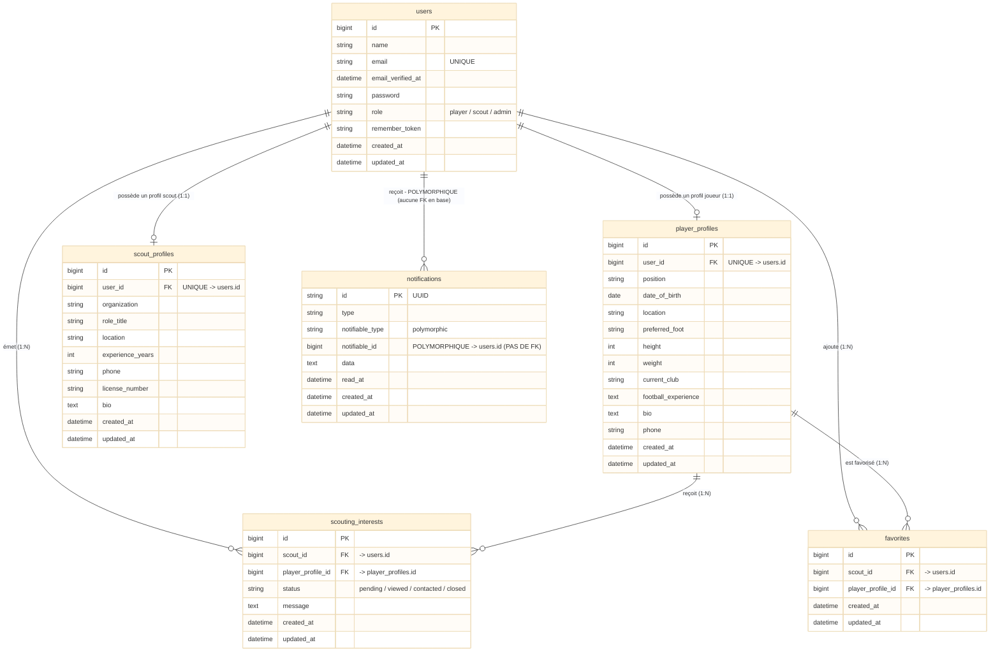

# TalentX11 — MLD (Modèle Logique de Données)

> Transformé à partir du MCD. Reprise des **noms réels des tables et colonnes Laravel** (`database/migrations/*`). Les tables framework Laravel et Spatie (inutilisées) sont exclues du périmètre de présentation.

---

## 1. Diagramme MLD (tables relationnelles)

**Rendu :**

**Source (Mermaid) :**

> **Contraintes composites UNIQUE** non représentables sur le trait : `UNIQUE(scout_id, player_profile_id)` sur `scouting_interests` et `favorites` — voir section 5.
> **INDEX supplémentaires** : `favorites(player_profile_id)` et `notifications(notifiable_type, notifiable_id)` (index morph).

---

## 2. Liste des tables relationnelles

### 2.1 `users` (UTILISATEUR)

| Colonne | Type | PK / FK | Contrainte |
|---|---|---|---|
| id | BIGINT | PK | Auto-incrément |
| name | VARCHAR | | NOT NULL |
| email | VARCHAR | | **UNIQUE** — NOT NULL |
| email_verified_at | TIMESTAMP | | Nullable |
| password | VARCHAR | | NOT NULL |
| role | VARCHAR | | NOT NULL, défaut `player` |
| remember_token | VARCHAR | | Nullable |
| created_at / updated_at | TIMESTAMP | | Nullable |

### 2.2 `player_profiles` (PROFIL_JOUEUR)

| Colonne | Type | PK / FK | Contrainte |
|---|---|---|---|
| id | BIGINT | PK | Auto-incrément |
| user_id | BIGINT | **FK → users.id** | **UNIQUE**, NOT NULL, ON DELETE CASCADE |
| position | VARCHAR | | NOT NULL |
| date_of_birth | DATE | | NOT NULL |
| location | VARCHAR | | NOT NULL |
| preferred_foot | VARCHAR | | Nullable |
| height | SMALLINT UNSIGNED | | Nullable |
| weight | SMALLINT UNSIGNED | | Nullable |
| current_club | VARCHAR | | Nullable |
| football_experience | TEXT | | Nullable |
| bio | TEXT | | Nullable |
| phone | VARCHAR | | Nullable |
| created_at / updated_at | TIMESTAMP | | Nullable |

### 2.3 `scout_profiles` (PROFIL_SCOUT)

| Colonne | Type | PK / FK | Contrainte |
|---|---|---|---|
| id | BIGINT | PK | Auto-incrément |
| user_id | BIGINT | **FK → users.id** | **UNIQUE**, NOT NULL, ON DELETE CASCADE |
| organization | VARCHAR | | NOT NULL |
| role_title | VARCHAR | | Nullable |
| location | VARCHAR | | NOT NULL |
| experience_years | SMALLINT UNSIGNED | | Nullable |
| phone | VARCHAR | | Nullable |
| license_number | VARCHAR | | Nullable |
| bio | TEXT | | Nullable |
| created_at / updated_at | TIMESTAMP | | Nullable |

### 2.4 `scouting_interests` (INTERET_DE_SCOUT) — table d'association riche

| Colonne | Type | PK / FK | Contrainte |
|---|---|---|---|
| id | BIGINT | PK | Auto-incrément |
| scout_id | BIGINT | **FK → users.id** | NOT NULL, ON DELETE CASCADE |
| player_profile_id | BIGINT | **FK → player_profiles.id** | NOT NULL, ON DELETE CASCADE |
| status | VARCHAR | | NOT NULL, défaut `pending` |
| message | TEXT | | Nullable |
| created_at / updated_at | TIMESTAMP | | Nullable |
| ^ | ^ | | **UNIQUE (scout_id, player_profile_id)** |

### 2.5 `favorites` (FAVORI) — table d'association simple

| Colonne | Type | PK / FK | Contrainte |
|---|---|---|---|
| id | BIGINT | PK | Auto-incrément |
| scout_id | BIGINT | **FK → users.id** | NOT NULL, ON DELETE CASCADE |
| player_profile_id | BIGINT | **FK → player_profiles.id** | NOT NULL, ON DELETE CASCADE |
| created_at / updated_at | TIMESTAMP | | Nullable |
| ^ | ^ | | **UNIQUE (scout_id, player_profile_id)** + INDEX (player_profile_id) |

### 2.6 `notifications` (NOTIFICATION)

| Colonne | Type | PK / FK | Contrainte |
|---|---|---|---|
| id | CHAR(36) | PK | UUID |
| type | VARCHAR | | NOT NULL |
| notifiable_type | VARCHAR | | NOT NULL — discriminateur polymorphique (`App\Models\User`) |
| notifiable_id | BIGINT | **POLYMORPHIQUE → users.id** | NOT NULL — **aucune contrainte FK en base**, index morph |
| data | TEXT | | NOT NULL — JSON |
| read_at | TIMESTAMP | | Nullable |
| created_at / updated_at | TIMESTAMP | | Nullable |

---

## 3. Transformation N:N → tables d'association

| M:N conceptuel | Table d'association | Attributs additionnels | Clé unique |
|---|---|---|---|
| UTILISATEUR(scout) ⇄ PROFIL_JOUEUR (intérêt) | `scouting_interests` | `status`, `message`, timestamps | UNIQUE(scout_id, player_profile_id) |
| UTILISATEUR(scout) ⇄ PROFIL_JOUEUR (favori) | `favorites` | timestamps | UNIQUE(scout_id, player_profile_id) |

Les relations R1/R2 (1:1) restent **1:1** grâce aux clés `user_id` en contrainte **UNIQUE**.

---

## 4. Correspondance des clés

| Table | Colonne | Type de clé | Cible | ON DELETE |
|---|---|---|---|---|
| `player_profiles` | `user_id` | FK + UNIQUE | `users.id` | CASCADE |
| `scout_profiles` | `user_id` | FK + UNIQUE | `users.id` | CASCADE |
| `scouting_interests` | `scout_id` | FK | `users.id` | CASCADE |
| `scouting_interests` | `player_profile_id` | FK | `player_profiles.id` | CASCADE |
| `favorites` | `scout_id` | FK | `users.id` | CASCADE |
| `favorites` | `player_profile_id` | FK | `player_profiles.id` | CASCADE |
| `notifications` | `notifiable_type` + `notifiable_id` | **Polymorphique (aucune FK)** | `users.id` | — |

---

## 5. Contraintes et clés uniques

| Table | Contrainte | Colonnes | Rôle |
|---|---|---|---|
| `users` | UNIQUE | `email` | Unicité de connexion |
| `player_profiles` | UNIQUE | `user_id` | 1 utilisateur = 1 profil joueur |
| `scout_profiles` | UNIQUE | `user_id` | 1 utilisateur = 1 profil scout |
| `scouting_interests` | UNIQUE | `(scout_id, player_profile_id)` | Pas de doublon d'intérêt d'un même scout |
| `favorites` | UNIQUE | `(scout_id, player_profile_id)` | Pas de doublon de favori d'un même scout |
| `favorites` | INDEX | `player_profile_id` | Requêtes par joueur |
| `notifications` | INDEX (morph) | `(notifiable_type, notifiable_id)` | Recherche polymorphique |

---

## 6. Tables hors périmètre (exclues des diagrammes)

- **Framework Laravel** : `password_reset_tokens`, `sessions`, `cache`, `cache_locks`, `jobs`, `job_batches`, `failed_jobs`
- **Spatie laravel-permission (instalées, jamais utilisées)** : `roles`, `permissions`, `model_has_roles`, `model_has_permissions`, `role_has_permissions`

---

*Voir `MCD.md`, `LEGEND.md` et `DOCUMENTATION.md`.*